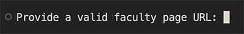

# SMHS Faculty Listing Generator

This is a command line interface (CLI) tool I developed to expedite my workflow in updating the HTML structure of faculty listings across all GW School of Medicine & Health Sciences (SMHS) websites.

## Process

The CLI takes in a URL of a valid SMHS faculty page, scrapes all faculty data from it and creates a new HTML structure that supports an improved format and fresh CSS styles.

The new HTML can just be pasted into the page editor. All valid hyperlinks within the scraped listings are preserved, so it leaves only the manual step of formatting and uploading new images.
